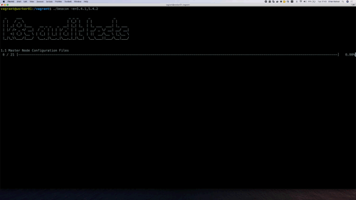

[](https://goreportcard.com/report/github.com/chen-keinan/beacon)
[](https://github.com/chen-keinan/beacon/blob/main/LICENSE)
[](https://travis-ci.com/chen-keinan/kube-beacon)
[](https://coveralls.io/github/chen-keinan/kube-beacon?branch=main)
[](https://gitter.im/kube-beacon/community?utm_source=badge&utm_medium=badge&utm_campaign=pr-badge)
<br><br>

# Kube-Beacon Project
###  Scan your kubernetes runtime !!
Kube-Beacon is an open source audit scanner who perform audit check on a deployed kubernetes cluster and output a security report.

The audit tests are the full implementation of [CIS Kubernetes Benchmark specification](https://www.cisecurity.org/benchmark/kubernetes/) <br>

NEW !! audit result now can be published to an external system via user plugin (go plugin) 
#### Audit checks are performed  on master and worker nodes and the output audit report include :
* root cause of the security issue
* proposed remediation for security issue

#### kubernetes cluster audit scan output: 
 

* [Installation](#installation)
* [Quick Start](#quick-start)
* [Kube-beacon as Docker](#Kube-beacon-as-Docker)
* [Kube-beacon as pod in k8s](#Kube-beacon-as-pod-in-k8s)
* [User Plugin Usage](#user-plugin-usage)
* [Next steps](#Next-steps)


## Installation

```sh
git clone https://github.com/chen-keinan/kube-beacon
cd kube-beacon
make install
```

- Note: kube-beacon require root user to be executed

## Quick Start

Execute kube-eacon without any flags , execute all tests 
```
 ./kube-beacon 

```

Execute kube-beacon  with flags , execute test on demand

```
Usage: kube-Beacon [--version] [--help] <command> [<args>]

Available commands are:
  -r , --report :  run audit tests and generate failure report
  -i , --include: execute only specific audit test,   example -i=1.2.3,1.4.5
  -e , --exclude, ignore specific audit tests,  example -e=1.2.3,1.4.5
  -n , --node,    execute audit tests on specific node,   example -n=master,-n=worker
  -s , --spec,    execute specific audit tests spec,   example -s=gke, default=k8s
  -v , --version, execute specific audit tests spec version,    example -v=1.1.0,default=1.6.0
```

Execute tests and generate failure tests report

```
./kube-beacon -r
```

## Kube-beacon as Docker

Execute kube beacon via docker 

```
docker run --pid=host  -v /etc:/etc:ro -v /var:/var:ro -v /*/cni/*:/*/cni/* -v $HOME/.kube:/root/.kube:ro -v $(which kubectl):/usr/bin/kubectl -t chenkeinan/kube-beacon
```

## Kube-beacon as pod in k8s

- Execute kube beacon as a pod in k8s cluster

- Add cluster role binding with role=cluster-admin
```
kubectl create clusterrolebinding default-admin --clusterrole cluster-admin --serviceaccount=default:default
```
```
cd jobs
```
- simple k8s cluster run following job

```
kubectl apply -f k8s.yaml
```

- gke cluster run the following jon

```
kubectl apply -f gke.yaml
```


- Check k8s pod status
```
kubectl get pods --all-namespaces

NAMESPACE     NAME                                                        READY   STATUS      RESTARTS   AGE
default       kube-beacon-sc8g9                                           0/1     Completed   0          111s
kube-system   event-exporter-gke-8489df9489-skcvv                         2/2     Running     0          7m24s
kube-system   fluentd-gke-7d5sl                                           2/2     Running     0          7m6s
kube-system   fluentd-gke-f6q5d                                           2/2     Running     0          6m59s
```

- Check k8s pod audit output
```
kubectl logs kube-beacon-sc8g9 
```

- cleanup (remove role and delete pod)
```
kubectl delete clusterrolebinding default-admin
```
```
kubectl delete -f k8s.yaml
```

## User Plugin Usage (via go plugins)
The Kube-Beacon expose hook for user plugins [Example](https://github.com/chen-keinan/kube-beacon/tree/master/examples/plugins) :
- **K8sBenchAuditResultHook** - this hook accepts audit benchmark results as found by audit report
##### Copy plugin to folder (.beacon folder is created on the 1st startup)
```
cp <plugin>.go ~/.beacon/plugins/source/<plugin>.go
```

## Next steps
- Add support for Amazon EKS scanning

